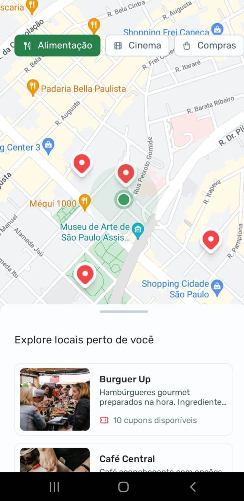
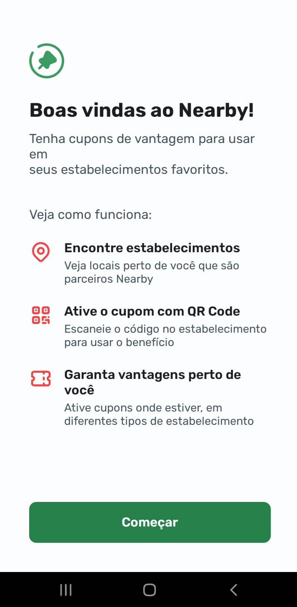
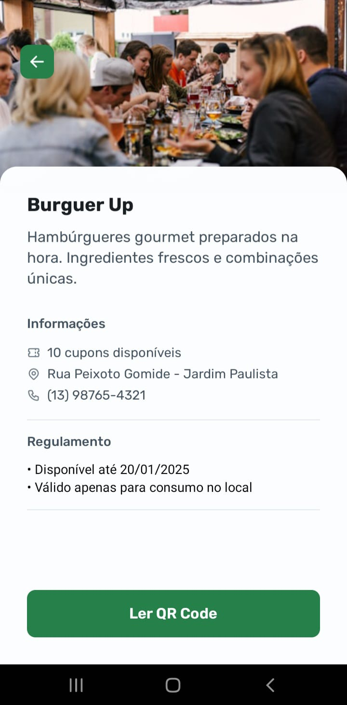

<h1 align="center" style="font-weight: bold;">Nearby NBL Mobile 💻</h1>

 <a href="#tecnologias">Tecnologias</a>

    <b>Uma aplicação que ajuda os usuários a descobrir lojas, restaurantes e comércios próximos oferecendo cupons, com mapas integrados, leitura de códigos de barras e funcionalidade de câmera.</b>

     <a href="PROJECT__URL">📱 Acesse o Projeto</a>

    <i>Este projeto foi desenvolvido durante o curso da <b>Rocketseat</b>.</i>

<h2 id="layout">🎨 Layout</h2>

    
    
    

<h2 id="tecnologias">💻 Tecnologias</h2>

- TypeScript
- React Native
- Expo Go
- Integração com mapas
- Câmera e leitura de códigos de barras
- API local (back-end)

<h2 id="instalacao">⚙️ Como Utilizar</h2>

    <b>Para utilizar este projeto, é necessário ter o <a href="https://reactnative.dev/docs/environment-setup" target="_blank">React Native</a> e o <a href="https://docs.expo.dev/get-started/installation/" target="_blank">Expo Go</a> instalados na sua máquina.</b>

<h3>Passos para rodar a aplicação localmente:</h3>

<ol>
  <li>Clone este repositório</li>
  <li>Entre no diretório do projeto</li>
  <li>Instale as dependências</li>
  <li>Inicie o servidor local</li>
</ol>

    <b>Agora você pode ver a aplicação rodando localmente!</b>

